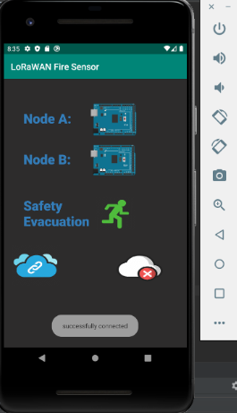
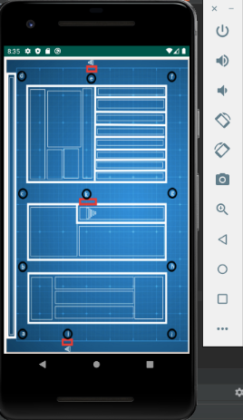
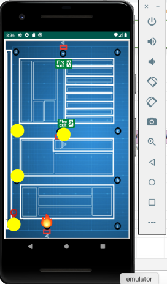

# FireSafe
Using Node.js (Node-Red), Java (Android Studio), and MQTT (eclipse paho) to make an app for an IoT system. More details of its functionality in the README.

**What is it?**

This is an app for residents in a building. The app provides a GUI that the residents can use to access 
readings from sensors within the building. Moreover, in the case of a fire emergency, they can 
navigate to the building blueprint screen and see, in real-time, where the fire is and the safest
path to the nearest exit. The app also sounds an alaram in the case of an emergency.

The LoRaWAN IoT system collects 'fire data' (temperature, humidity, and carbon monoxide readings)
via a Node (feather m0 microcontroller, sensors, lora transponder), forwards it to a gateway 
(Raspberry PI + RAK831 Lora module) that runs Node-Red. Using Dijkstra's algorithm the safest 
path is determined. The path directions are packaged into JSON format. The app subscribes to the
MQTT broker, parses the data, and displays it on a user friendly GUI.

Credits:
* Christopher D'leema for using Dijkstra algorithm to determine safest path.
* Kalp Shah for reading sensor data from the node.

**How can you test it?**
You will need: 
- An **MQTT broker** to handle the communication
- **Node.js** to run node-red flows

1) Open node-red 
2) Import the 'testDijsktraFlow.json' file	
3) Enter your MQTT broker information in the MQTT node 
4) Deploy the flow
5) Enter your MQTT broker information (MQTTHOST, USERNAME, PASSWORD) in NodeAActivity.java, 
   NodeABActivity.java and SafetyActivity.java
6) Navigate to safety path activity (click green person button)
7) Inject a test path from node-red to test app

**How does it look?**

**Home screen**

**building blueprint**

**building blueprint with safest path highlighted**

**Sensor data display screen**

